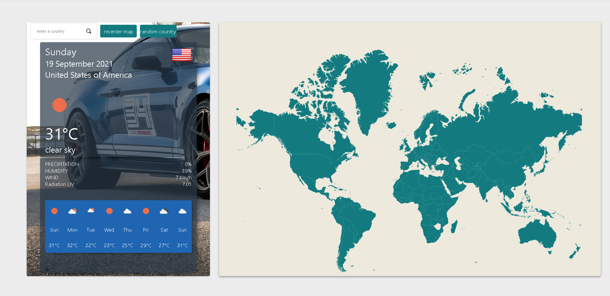

# Weather-App
## Table of contents
* [General info](#general-info)
* [Technologies](#technologies)
* [ScreenShot](#screenshot)
* [Room for Improvement](#room-for-improvement)
* [Sources](#sources)
* [Acknowledgements](#acknowledgements)

## General info
This project is a d3 visualisation based map of the world which show the weather of choosen country.
	
## Technologies
Project is created with:
* react create-my-app
* d3
* npm countries-api

## ScreenShot

## Room for Improvement
- Finish project3D 
- Boosting performence quality

## Sources
* Weather information from [OpenWeather](https://openweathermap.org/)
* Country information from [countries-api](https://www.npmjs.com/package/countries-api) && [REST Countries](https://restcountries.eu/)

## Acknowledgements
* This project was based on [Curran Kelleher](https://www.youtube.com/watch?v=mzZ1fCXq-uo&list=PL9yYRbwpkykuK6LSMLH3bAaPpXaDUXcLV&index=32) "making a world map in react"
* [@daniel-payne](https://github.com/daniel-payne/demotracker-client/tree/67ec30b84a9f60b77c7ea4fe9c3fdd829f387b82) repository
